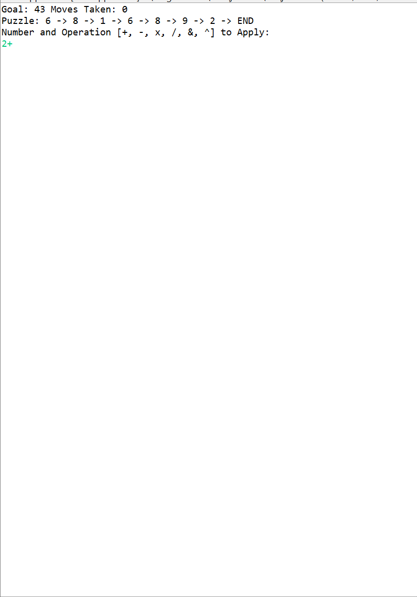

# Math-Game

For **Math-Game**  assignment, you will be implementing a math game in which the player is presented with a list of numbers and a target goal number.  The player will choose one of these numbers along with an operator: addition (+), subtraction (-), multiplication (x), division (/), or concatenation (&).  The chosen number will then be combined with the number following it in the list using the specified operator, so that two list elements become one.  Before these nodes are combined, a new randomly chosen value is added to the end of the list, so that the final length of the list remains the same.  The player makes repeated choices like this, until the target number appears as one of the values within the list. 

Author: **[Ajmain Naqib](mailto:naqib@wisc.edu)**

Course: CS300, Fall 2018    Lecturer's Name: Gary Dahl

Time spent: **3.5** hours spent in total

## Project Introduction

The following **required** functionality is completed:

* [X] THE GAME OPERATOR CLASS
* [X] THE GAME NODE AND GAME LIST CLASSES
* [X] THE GAME APPLICATION CLASS

Optional: 
* [ ] Try adding an extra operators that take a different number of operands as arguments.  For example, you could implement a < operator that replaces a chosen number with the smallest value between the chosen node and the next two numbers in the list.  Since this operator would remove two nodes rather than one, an extra random node should be added to keep the length of the list consistent.
* [ ]  Now that you have had some experience with the processing graphics library, you could try implementing a graphical implementation of this game.  You could have operator objects (like the Tigers from JunglePark) that can be dragged onto or near separate number objects, to be applied to them.  You might also use the line() method in the processing library to connect the numbers in the order they appear within the list.

More information about this project can be found [here.](http://cs300-www.cs.wisc.edu/wp/index.php/2018/10/15/p06-math-game/) 

## Video Walkthrough

Here's a walkthrough of implemented functionality:

GIF created with [LiceCap](http://www.cockos.com/licecap/).

## Notes

## License

    Copyright [2018] [Ajmain Naqib]

